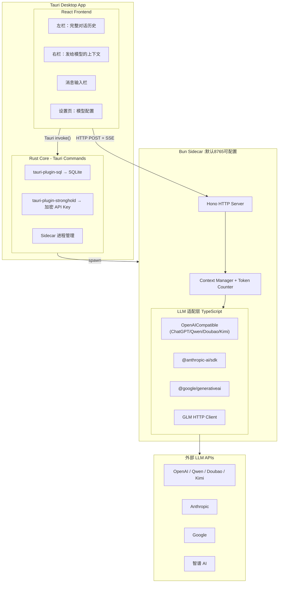

# LLM Chat Desktop App 设计方案（更新版）

## 为什么不用 Python？

| | Python FastAPI | TypeScript Sidecar（Bun） |
|---|---|---|
| 安装包体积 | +80-150MB（需打包 Python 运行时） | +15-30MB（Bun 单文件可执行） |
| LLM SDK 生态 | 完整 | 完整（openai / @anthropic-ai/sdk / @google/generativeai） |
| 与前端共享类型 | 不能 | 可以（共享 TypeScript 类型定义） |
| 主流 AI 工具选择 | 极少 | Cursor / Continue / Claude Code 均基于此 |

---

## 现有工具分析

主流 LLM 对话工具（ChatGPT / Claude / Gemini）的核心功能：
- 会话管理（创建、重命名、删除、搜索）
- 消息流式输出（Streaming）
- 模型切换与参数配置（temperature, max_tokens 等）
- 系统提示词（System Prompt）
- Markdown / 代码块高亮渲染
- 消息操作（复制、重新生成、编辑）
- 本地持久化存储

**它们的缺失点（本项目的差异化核心）：**
- 上下文内容对用户不透明，无法手动干预
- 无法直观看到「实际发给模型的是什么」

---

## 技术栈

- **桌面框架**: Tauri 2.x（Rust 核心，轻量）
- **前端**: React 18 + TypeScript + Vite（当前 MVP 用 `App.css`/`index.css`；**Tailwind 为可选**，后续再定）
- **状态管理**: Zustand
- **LLM Sidecar**: Bun + Hono（TypeScript HTTP 服务器，打包为单文件可执行）
- **存储**: SQLite（通过 `tauri-plugin-sql` 从前端 Tauri IPC 访问，无需绕道 sidecar）
- **安全存储**: `tauri-plugin-stronghold`（API Key 加密存储，使用系统 keychain）
- **通信**:
  - 前端 ↔ Tauri Rust 命令（IPC）：数据库读写、设置、API Key
  - 前端 → Bun Sidecar（HTTP + SSE）：LLM 流式输出

---

## 整体架构



---

## 职责边界

| 层 | 语言 | 职责 |
|---|---|---|
| Rust / Tauri 命令 | Rust | SQLite 读写、API Key 加密存储、sidecar 进程生命周期、文件系统 |
| Bun Sidecar | TypeScript | LLM API 调用、流式 SSE 转发、token 计数、上下文压缩 |
| React 前端 | TypeScript | 所有 UI 逻辑、状态管理（Zustand）、双栏同步 |
| 共享类型包 | TypeScript | **目标**：`packages/types` 或 `frontend/src/types` 与 sidecar 同步；当前类型在 `frontend/src/types.ts` |

---

## 计划与仓库现状对齐（必读）

| 项 | 原计划 | 当前仓库 / 建议 |
|---|---|---|
| 前端路径 | 根目录 `src/` | **`frontend/src/`**（Vite 默认） |
| Rust 命令 | `commands.rs` | 命令在 **`src-tauri/src/main.rs`**；`commands.rs` 为后续拆分 |
| Sidecar 端口 | 随机端口 | 默认 **`8765`**（`SIDECAR_PORT`）；已 `console.log('SIDECAR_READY:…')`；**Tauri 消费并 `emit` 给前端仍为待办** |
| 浏览器开发 | 仅 fetch | **`localhost:5173` → `127.0.0.1:8765` 可能 CORS**：sidecar 加 CORS 头或 Vite `proxy` |
| Stronghold | Stronghold 插件 `save_secret` 等 API | **目标**；当前占位 **`save_api_key` Tauri 命令** |
| `providers.json` / adapters | 已存在 | **待创建**（Phase 1） |
| `externalBin` | 打包嵌入 | **`tauri.conf.json` 已配置**；发布前须 **`bun build` 产出 `sidecar/dist/llm-sidecar`** |

---

## 数据模型（SQLite，via tauri-plugin-sql）

### conversations
- `id TEXT PRIMARY KEY`, `title TEXT`, `model_id TEXT`, `system_prompt TEXT`
- `context_strategy TEXT`（`auto_trim` / `manual` / `summarize`）
- `created_at INTEGER`, `updated_at INTEGER`

### messages
- `id TEXT PRIMARY KEY`, `conversation_id TEXT`, `role TEXT`（user/assistant/system）
- `display_content TEXT`：左栏展示内容（原始，永久保留，不可删除）
- `context_content TEXT`：右栏实际发给模型的内容（可独立修改）
- `in_context INTEGER`（0/1），`is_context_modified INTEGER`（0/1）
- `token_count INTEGER`, `created_at INTEGER`

### model_profiles
- `id TEXT`, `name TEXT`, `provider TEXT`, `adapter TEXT`
- `base_url TEXT`, `context_window INTEGER`, `default_params TEXT`（JSON）

---

## 双栏视图设计（核心差异化功能）

```
┌────────────────────────────┬───────────────────────────────┐
│  左栏：完整对话历史          │  右栏：发给模型的上下文          │
│  (全量只读，视觉标注状态)    │  (可编辑，token 用量实时显示)    │
├────────────────────────────┼───────────────────────────────┤
│ [user]  你好                │  ● Token: 1,234 / 128,000     │
│ [asst]  你好！               │  ████████░░░░░░░░  9.6%       │
│ [user]  解释量子纠缠  [●上]  │                               │
│ [asst]  量子纠缠是…          │  [sys]  你是一个助手            │
│ [user]  继续      [✕已移除] │  [user] 解释量子纠缠            │
│ [asst]  此外…     [✕已移除] │  [asst] [摘要：量子纠缠是…]  ✎ │
│ [user]  好的      [●上]     │  [user] 好的                   │
│                             │  [+ 插入自定义消息]             │
└────────────────────────────┴───────────────────────────────┘
```

左栏消息状态标注：
- 正常色：当前在上下文中，且内容未修改
- 橙色角标 `✎`：在上下文中，但内容已被编辑
- 灰色 `✕`：已从上下文中移除

右栏操作：
- 拖拽排序消息
- 点击消息 → 弹出编辑器修改上下文内容（不影响左栏显示）
- 从上下文移除 → 左栏对应消息变灰
- 一键「压缩早期对话」→ 调用 LLM 生成摘要并替换
- Token 进度条，超过 80% 显示警告，超过 95% 高亮报错

---

## LLM 适配层（TypeScript）

```typescript
// packages/types/src/llm.ts
interface LLMMessage { role: 'user' | 'assistant' | 'system'; content: string }
interface StreamParams { model: string; temperature?: number; maxTokens?: number }

abstract class BaseLLMAdapter {
  abstract streamChat(messages: LLMMessage[], params: StreamParams): AsyncGenerator<string>
  abstract countTokens(messages: LLMMessage[]): Promise<number>
}

// 复用 openai SDK：ChatGPT / Qwen / Doubao / Kimi 均兼容 OpenAI 协议
class OpenAICompatibleAdapter extends BaseLLMAdapter {
  constructor(private apiKey: string, private baseUrl: string, private model: string) {}
}

class AnthropicAdapter extends BaseLLMAdapter { ... }   // @anthropic-ai/sdk
class GeminiAdapter extends BaseLLMAdapter { ... }      // @google/generativeai
class GLMAdapter extends BaseLLMAdapter { ... }         // 自定义 HTTP，兼容 OpenAI
```

**模型注册表**（目标路径 **`sidecar/providers.json`**，与 `sidecar/src` 并列；亦可放在 `src/` 下由构建拷贝）：

```json
[
  { "id": "gpt-4o",         "name": "GPT-4o",      "adapter": "openai",  "baseUrl": "https://api.openai.com/v1",                                        "contextWindow": 128000 },
  { "id": "claude-3-7",     "name": "Claude 3.7",  "adapter": "anthropic",                                                                               "contextWindow": 200000 },
  { "id": "gemini-2.5-pro", "name": "Gemini 2.5",  "adapter": "gemini",                                                                                  "contextWindow": 1000000 },
  { "id": "qwen-max",       "name": "通义千问",     "adapter": "openai",  "baseUrl": "https://dashscope.aliyuncs.com/compatible-mode/v1",                 "contextWindow": 32000 },
  { "id": "doubao-pro",     "name": "豆包",         "adapter": "openai",  "baseUrl": "https://ark.cn-beijing.volces.com/api/v3",                          "contextWindow": 128000 },
  { "id": "kimi-latest",    "name": "Kimi",         "adapter": "openai",  "baseUrl": "https://api.moonshot.cn/v1",                                        "contextWindow": 128000 },
  { "id": "glm-4",          "name": "智谱 GLM-4",  "adapter": "glm",     "baseUrl": "https://open.bigmodel.cn/api/paas/v4",                              "contextWindow": 128000 }
]
```

---

## 上下文管理策略

三种模式，每个会话独立配置：
- **auto_trim**：接近 context_window 时，自动移除最旧消息（始终保留 system prompt）
- **manual**：完全由用户手动在右栏管理，不自动干预
- **summarize**：早期消息超出阈值时，调用当前 LLM 生成摘要替换（摘要条目在右栏有特殊样式）

---

## 项目目录结构

### 当前实际（与仓库一致）

```
llm_chat_app/
├── frontend/
│   └── src/
│       ├── App.tsx
│       ├── components/          # ConversationPane, ContextPane, MessageInput, ModelSelector
│       ├── stores/chatStore.ts
│       ├── lib/sidecarClient.ts
│       ├── lib/tauriBridge.ts
│       └── types.ts
├── sidecar/
│   ├── src/index.ts             # Hono；默认端口 8765；SIDECAR_READY 日志
│   └── package.json
├── src-tauri/
│   ├── src/main.rs              # 插件 + save_conversation / save_api_key 占位（尚无 commands.rs）
│   ├── Cargo.toml
│   └── tauri.conf.json          # externalBin → ../sidecar/dist/llm-sidecar
├── PROJECT_PLAN.md
├── README.md
└── package.json                 # workspaces: frontend, sidecar
```

### 目标演进（Phase 1～3 逐步靠拢）

```
llm_chat_app/
├── src-tauri/src/
│   ├── main.rs                  # 入口：插件、spawn sidecar
│   └── commands.rs              # 端口、密钥、DB 桥接等（从 main.rs 拆分）
├── frontend/src/
│   ├── components/layout|message|input|settings/
│   ├── stores/                  # 可拆 conversationStore / messageStore / modelStore
│   ├── lib/db.ts, sidecarClient.ts, keychain.ts
│   └── types/                   # 或与 sidecar 共享 packages/types
├── sidecar/src/
│   ├── index.ts
│   ├── routes/chat.ts
│   ├── adapters/
│   └── services/
└── sidecar/providers.json
```

---

## 关键实现要点

**流式输出链路（协议目标不变）**

```
React → POST /chat/stream（JSON：conversationId、modelId、messages）
      ← SSE: data: {"delta":"..."}\n\n
      ← SSE: data: {"usage":{...}}\n\n   # 可选，待实现
      ← data: [DONE]\n\n
```

**Sidecar 就绪与端口**

- 现状：`SIDECAR_READY:${port}` 写入 stdout（`sidecar/src/index.ts`）；前端可用 `localStorage.sidecar_url` 兜底。
- 待办：Tauri spawn 后解析端口或固定协商，**`app.emit('sidecar-ready', { port })` 或 `invoke` 返回**；随机端口与此同属一项。

**双栏状态（Zustand）——现状 vs 演进**

- **当前 MVP**：单一 `messages: ChatMessage[]`，字段含 `displayContent`、`contextContent`、`inContext`；发送时对 `inContext` 过滤组装 payload。
- **可选演进**：`messages` + `contextMessages`（或 `contextOrder`）双结构，便于右栏独立排序、仅上下文影子条目；非当前实现。

**API Key**

- **目标**：Stronghold 插件 API（如 `invoke('plugin:stronghold|save_secret', { vault, key, value })`）或经 Rust 封装的 `save_api_key` 写入 vault。
- **Sidecar 用 key**：前端经 IPC 取得后**单次请求传入**或握手写入 sidecar **进程内存**，避免长期留在 WebView。

**浏览器开发与 CORS**

- `vite dev`（5173）直连 sidecar（8765）可能 **Failed to fetch / CORS**：sidecar 返回 `Access-Control-Allow-Origin`（开发可放宽），或 Vite `server.proxy` 代理 `/chat`。

**打包策略**

- `bun build src/index.ts --compile --outfile dist/llm-sidecar`（与 `sidecar/package.json` 一致）。
- `tauri.conf.json` 的 `bundle.externalBin` 已指向 sidecar 二进制；**`tauri build` 前必须先产出该文件**，否则打包失败。